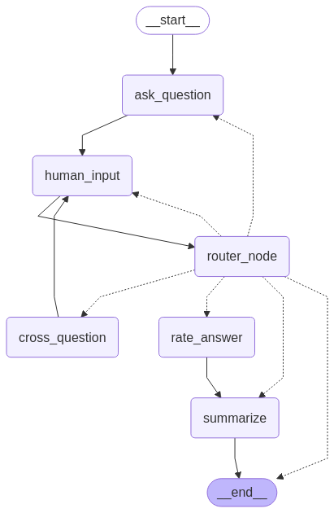

# intervUAI

An AI-powered mock interview engine built with **LangGraph** and **LangChain**. It conducts an automated interview based on a candidate's resume and a job description (or an optional knowledge base), asks questions, supports human-in-the-loop follow-up ("cross-questioning"), rates answers, and produces a final summary — with state persisted in **Redis** across turns.

## How it works

The interview flow is modeled as a stateful graph (via LangGraph). The graph structure (visualized in `graph.png`, generated by `display_graph.py`) is:

```
__start__
   │
   ▼
ask_question ──────────────┐
   │                        │
   ▼                        │
human_input                 │
   │  ▲                     │
   ▼  │                     ▼
router_node ──────────► (loops back to ask_question / human_input)
   │        │
   ▼        ▼
cross_question   rate_answer
                     │
                     ▼
                 summarize
                     │
                     ▼
                  __end__
```

**Node responsibilities:**
- **ask_question** — generates the next interview question (from the resume/JD or knowledge base).
- **human_input** — waits for the candidate's response (interrupt/resume pattern).
- **router_node** — decides the next step: ask a follow-up, cross-question, move to rating, or end.
- **cross_question** — probes deeper into a candidate's answer before returning to `human_input`.
- **rate_answer** — scores the candidate's answers.
- **summarize** — produces a final evaluation summary once the interview ends.

## Files

### `main.py`
Entry point exposing the core interview API, backed by a Redis-based LangGraph checkpointer (`RedisSaver`) so interview sessions can be paused and resumed across requests.

- **`invoke(resume_text, position, use_kb, category_percent, jd_text, kb_url)`**
  Starts a new interview session.
  - Creates a new `thread_id` (session ID) and builds/compiles the interview graph.
  - If `use_kb == 1`, questions are sourced from a knowledge base fetched via `fetch_knowledge_data(kb_url)`.
  - Otherwise, questions are driven by the provided `resume_text` and `jd_text`.
  - Returns the first AI message and the new `session_id`.

- **`resume(user_input, session_id)`**
  Resumes an in-progress interview with the candidate's latest answer (`user_input`), using LangGraph's `Command(resume=...)` mechanism.
  - Returns the next AI message, or an `{"end": true}` payload once the interview is complete (based on `end`/`route` state or the configured question count).

- **`summarize(session_id)`**
  Loads the last checkpointed state for a session from Redis and runs the `Evaluation` node to produce:
  - a JSON **summary** of the interview, and
  - **ratings** for the candidate's answers.

### `display_graph.py`
Utility script for visualizing the interview graph.
- Builds the graph with dummy resume/JD text (for structure inspection only, not a real interview).
- Renders it to a PNG using LangChain's Mermaid drawing API (`draw_mermaid_png`).
- Run it directly to regenerate `graph.png`:
  ```bash
  python display_graph.py
  ```

### `graph.png`

The rendered visualization of the interview graph (see diagram above), auto-generated by `display_graph.py`.

## Requirements

- Python 3.9+
- `langchain`, `langchain-core`
- `langgraph`
- A Redis instance (for checkpointing session state)
- Project-internal modules under `intervUAI/`:
  - `nodes.interview_ai_graph.build_interview_graph`
  - `nodes.load_kb.fetch_knowledge_data`
  - `nodes.input_parser.parse_inputs`
  - `nodes.final_evaluation.Evaluation`
  - `checkpointer.redis_checkpointer.RedisSaver`

## Configuration

Redis connection settings are read from environment variables:

| Variable | Description |
|---|---|
| `host` | Redis host |
| *(port)* | Currently hardcoded to `6380` in `main.py` |

> **Note:** the `host` env var name is lowercase in the current code (`os.getenv("host")`) — consider aligning this with a more conventional name like `REDIS_HOST` for clarity.

## Usage example

```python
from main import invoke, resume, summarize

# Start an interview
ai_message, session_id = invoke(
    resume_text="Experienced software developer with AI/ML expertise.",
    position="AI Engineer",
    use_kb=0,
    category_percent={"technical": 70, "behavioral": 30},
    jd_text="Looking for an AI engineer with experience in NLP, LangChain, and LLMs.",
    kb_url=None,
)

# Continue the conversation with the candidate's answer
next_message, session_id = resume("My answer to the question...", session_id)

# Once the interview signals completion, generate the summary and ratings
summary, ratings, session_id = summarize(session_id)
```

## Known issues / TODOs

- `invoke()` swallows all exceptions and returns them as strings alongside a placeholder session ID (`"sdas"`) on failure — this should be replaced with proper error handling/logging.
- Error handling in `resume()` is currently commented out.
- Port `6380` is hardcoded; consider making it configurable via an environment variable alongside `host`.
